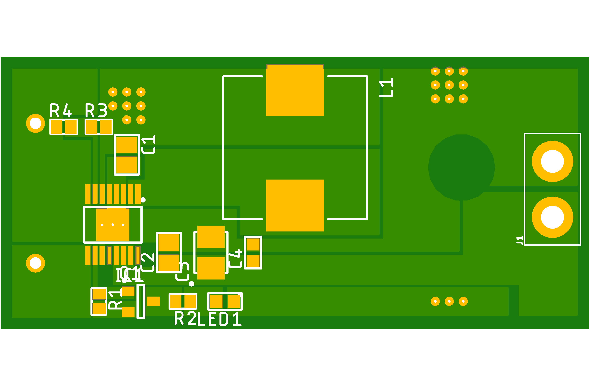

# A Collection of Voltage Converters
> See List Below

Herein are a collection of Voltage / Boost Converters built for different projects using different ICs
Best thing to do is read the whitepapers if you decide to make your own

| Name                              | Gerber                          | Production |
| ----------------------------------------------- | ---------------------------------------------- | ----------------------------------------------- |
| TPS61032-AAA |  |  |
| MCP1642b |  |  |
| MP9361 |  |  |
| TPS61032 |  |  |
| TPS61099x |  |  |
| TPS613222A |  |  |